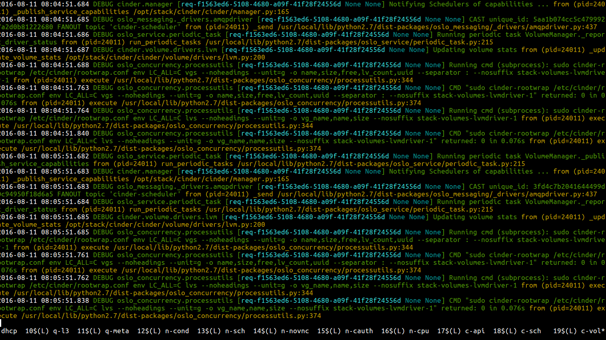

==========================
 Developing with Devstack
==========================

Now that you have your nifty DevStack up and running, what can you do
with it?

Inspecting Services
===================

By default most services in DevStack are running in a `screen
<https://www.gnu.org/software/screen/manual/screen.html>`_
session.

.. code-block:: bash

   os3:~> screen -list
   There is a screen on:
        28994.stack	(08/10/2016 09:01:33 PM)	(Detached)
   1 Socket in /var/run/screen/S-sdague.

You can attach to this screen session using ``screen -r`` which gives
you a view of the services in action.

Basic Screen Commands
---------------------

The following minimal commands will be useful to using screen:

* ``ctrl-a n`` - go to next window. Next is assumed to be right of
  current window.
* ``ctrl-a p`` - go to previous window. Previous is assumed to be left
  of current window.
* ``ctrl-a [`` - entry copy/scrollback mode. This allows you to
  navigate back through the logs with the up arrow.
* ``ctrl-a d`` - detach from screen. Gets you back to a normal
  terminal, while leaving everything running.

For more about using screen, see the excellent `screen manual
<https://www.gnu.org/software/screen/manual/screen.html>`_.

Patching a Service
==================

If you want to make a quick change to a running service the easiest
way to do this is:

* attach to screen
* navigate to the window in question
* ``ctrl-c`` to kill the service
* make appropriate changes to the code
* ``up arrow`` in the screen window to display the command used to run
  that service
* ``enter`` to restart the service

This works for services, except those running under Apache (currently
just ``keystone`` by default).

.. warning::

   All changes you are making are in checked out git trees that
   DevStack thinks it has full control over. Uncommitted work, or
   work committed to the master branch, may be overwritten during
   subsequent DevStack runs.

Testing a Patch Series
======================

When testing a larger set of patches, or patches that will impact more
than one service within a project, it is often less confusing to use
custom git locations, and make all your changes in a dedicated git
tree.

In your ``local.conf`` you can add ``**_REPO``, ``**_BRANCH`` for most projects
to use a custom git tree instead of the default upstream ones.

For instance:

.. code-block:: bash

   [[local|localrc]]
   NOVA_REPO=/home/sdague/nova
   NOVA_BRANCH=fold_disk_config

Will use a custom git tree and branch when doing any devstack
operations, such as ``stack.sh``.

When testing complicated changes committing to these trees, then doing
``./unstack.sh && ./stack.sh`` is often a valuable way to
iterate. This does take longer per iteration than direct patching, as
the whole devstack needs to rebuild.

You can use this same approach to test patches that are up for review
in gerrit by using the ref name that gerrit assigns to each change.

.. code-block:: bash

   [[local|localrc]]
   NOVA_BRANCH=refs/changes/10/353710/1

Testing Changes to Apache Based Services
========================================

When testing changes to Apache based services, such as ``keystone``,
you can either use the Testing a Patch Series approach above, or make
changes in the code tree and issue an apache restart.

Testing Changes to Libraries
============================

When testing changes to libraries consumed by OpenStack services (such
as oslo or any of the python-fooclient libraries) things are a little
more complicated. By default we only test with released versions of
these libraries that are on pypi.

You must first override this with the setting ``LIBS_FROM_GIT``. This
will enable your DevStack with the git version of that library instead
of the released version.

After that point you can also specify ``**_REPO``, ``**_BRANCH`` to use
your changes instead of just upstream master.

.. code-block:: bash

   [[local|localrc]]
   LIBS_FROM_GIT=oslo.policy
   OSLOPOLICY_REPO=/home/sdague/oslo.policy
   OSLOPOLICY_BRANCH=better_exception

Because libraries are used by many services, library changes really
need to go through a full ``./unstack.sh && ./stack.sh`` to see your
changes in action.

To figure out the repo / branch names for every library that's
supported, you'll need to read the devstack source.
